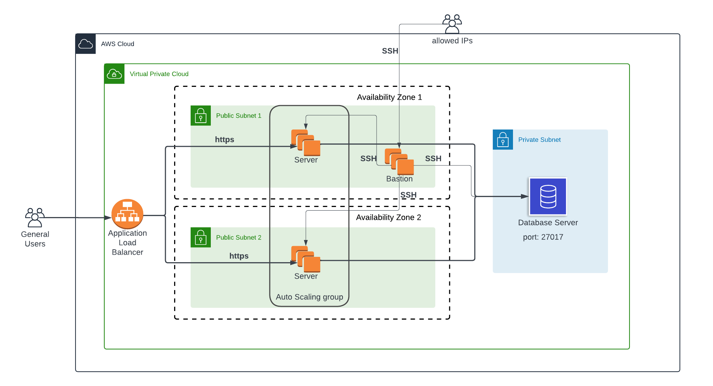

# Altschool Capstone Project
## Group 23



### Infrastructure

- Provider Setup: Started by configuring the desired provider, AWS.

- Centralized State Storage: Used AWS S3 bucket to store statefiles for centralized and secure storage.

- VPC Definition: Defined the VPC resource in Terraform, specifying the desired CIDR block.

- Subnet Creation: Created two public subnets using Terraform, ensuring they were located in separate availability zones within the VPC. By specifying the CIDR block, VPC ID, and availability zone for each subnet.

- Route Table Configuration: Configured the route tables for each subnet, including a default route for the internet gateway. By associating the public subnets with the public route table, enabled outbound internet access effortlessly.

- Security Group Setup: Defined security groups for the instances, one for the bastion host and another for the database instance. Carefully specifying the inbound and outbound rules allowed to control traffic access effectively.

- Private Subnet Configuration: With Terraform, a private subnet within the VPC was successfully created. By specifying the CIDR block and availability zone, and associating it with a separate route table without a default route to the internet gateway, enhanced security was established.


# Configuration Management

Configuration is handled using ansible. Config files can be found [here](./ansible).

For initial setup, an ansible role is used to setup monitoring on all servers.

```bash
ansible-playbook playbook/deploy_monitoring.yml  -i inventories/production/ --tags server --limit 'monitoring-server' --private-key <path-to-private-key-file>
```